# Guitar Tab Inference - Process Documentation

Work-in-progress documentation of our approach to infer which guitar strings are played from video using edge detection and motion blur.

---

## Hypothesis

When a guitar string is played, it vibrates at high speed. This motion causes **blur** in the video frame: the string "smears" across multiple pixels. A stationary string has sharp edges; a vibrating string has softer, spread-out edges. Therefore: **a drop in edge intensity** around a string indicates it was likely played.

---

## Pipeline Overview

1. **String Tracking** - Detect the 6 string positions and track edge intensity per string
2. **Hands Region** - Find the relevant zone between the two hands (filter out fretting/strumming hands)
3. **Suspect Detection** - Scan video for frames where edge intensity drops (within the relevant zone)
4. **Annotation** - Human validates/corrects suspects and tags missed frames
5. **Evaluation** (future) - Compare algorithm output to annotations

---

## Part 1: String Tracking

### Calibration: Finding the Strings

We use the first frame to locate the 6 strings. The process:

#### Step 1: Original Frame

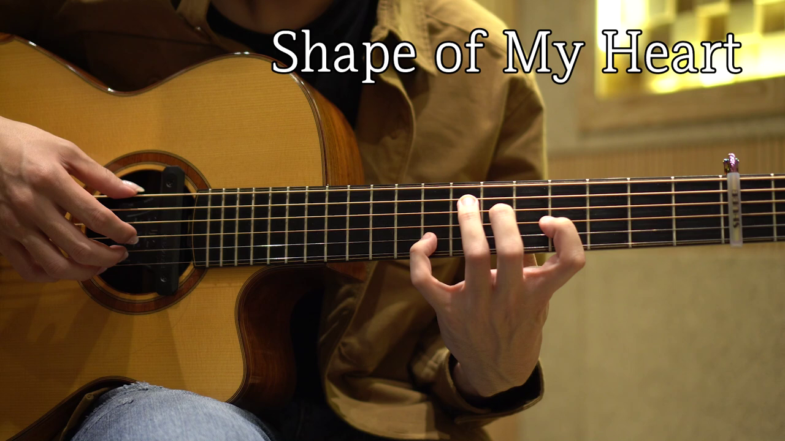

#### Step 2: Region of Interest

Define the fretboard area via `config/hands_region.json` (`roi_height`, `roi_width`). Use `"auto"` to let hands_region detect the zone between hands, or `[minFrac, maxFrac]` for fixed fractions (default 20%-80%). We crop to this region before edge detection.

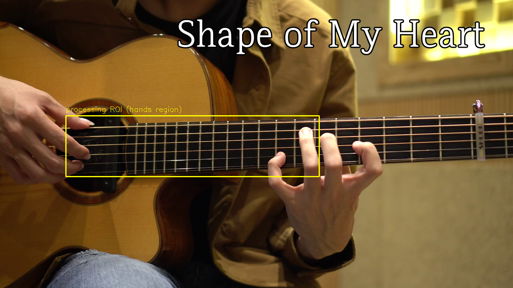

#### Step 3: Crop and Edge Detection

Crop the grayscale to the ROI, then apply Canny edge detection (thresholds 50, 150). Only the fretboard region is processed - this reduces noise from hands, face, and background.

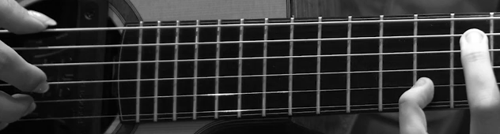

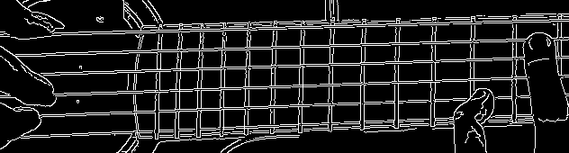

#### Step 4: Hough Line Transform

Run `cv2.HoughLinesP` on the cropped edges to find line segments. We keep lines that are roughly horizontal (within 35 degrees) since guitar strings run across the frame.

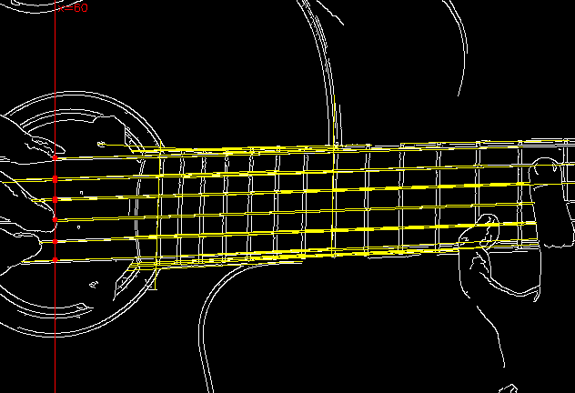

#### Step 5: Select 6 String Lines

- Sort candidate lines by vertical position at frame center
- Pick 6 evenly spaced lines (top = string 1, bottom = string 6)
- If Hough fails, fallback to 6 evenly spaced horizontal bands in the ROI
- Convert line coordinates back to full-frame for overlay


#### Iteration: Actual Cropping

**Originally** we applied Canny to the full frame and only used the ROI for Hough. The edge image was full-size. **Changed** to crop the grayscale to the ROI before Canny - edge detection now runs only on the fretboard, reducing noise from hands and background.

#### Iteration: Angled Strings

**Originally** we assumed strings were strictly horizontal. **Changed** because the camera angle or fretboard perspective often makes strings appear at a slight angle. We now use `detectStringLinesAngled` which allows lines up to 35 degrees from horizontal and returns full line segments `(x1,y1,x2,y2)` instead of just y-positions.

---

### Edge-to-String Assignment

We need to assign each edge pixel to a string for visualization and intensity tracking.

#### Iteration: Distance vs Band Boundaries

**Originally** we used "nearest string line" by perpendicular distance. **Problem**: with angled strings and occlusion (e.g. hand), string 1 could "steal" edges from string 2 - each string took some from the one below. **Changed** to band-based assignment: at each x, compute the y-position of each string line; boundaries are midpoints between adjacent strings; each edge falls into exactly one band. Non-overlapping, respects angle.

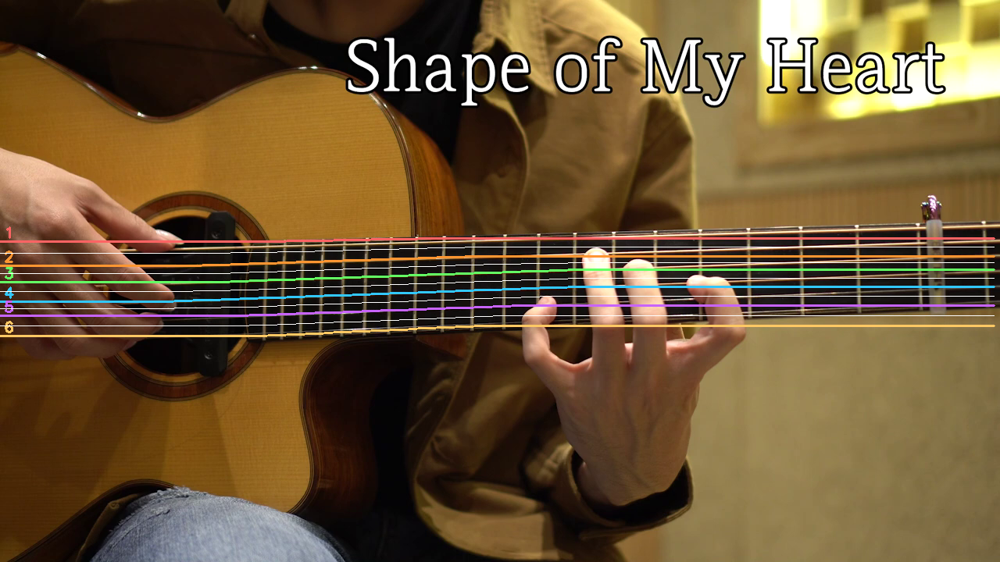

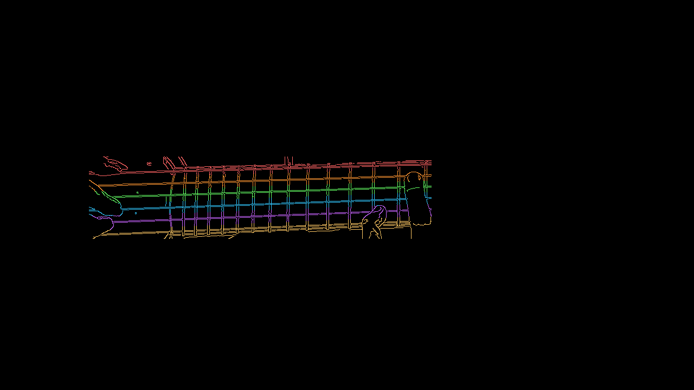

#### Final Overlay

Frame with colored edges (in ROI) and string legend (bottom right).

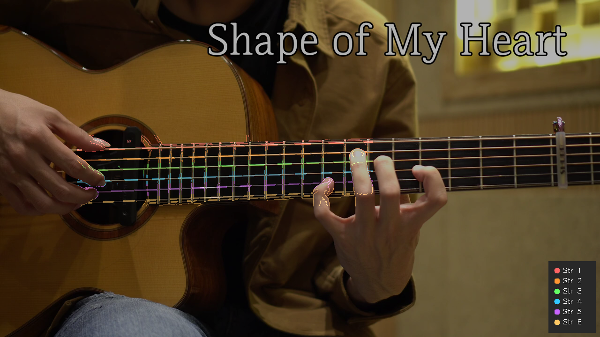

---

### Suspect Detection (String Intensity)

For each frame we compute **edge intensity** per string: mean vertical Sobel gradient in a band around the string line. A rolling median over the previous 25 frames gives the baseline. If `current < baseline * (1 - 0.18)` (18% drop), we mark that string as suspected.


---

## Part 2: Hands Region Detection

The hands (fretting and strumming) occlude parts of the strings. Edge intensity computed over the full frame width is diluted by static hand regions. We restrict analysis to the **relevant zone** between the two hands, where strings are visible and motion blur from playing is detectable.

### Algorithm

Two signals are combined:

1. **Skin detection** - Hands have high skin density. Columns with low skin fraction = between hands.
2. **String visibility** - Columns where all 6 strings have strong edges = between hands (strings visible, not occluded).

When both succeed, we use their intersection; otherwise the longer run. We then stretch left and right to better match hand positions. Per-frame detection with temporal smoothing (exponential moving average). No per-video calibration required.

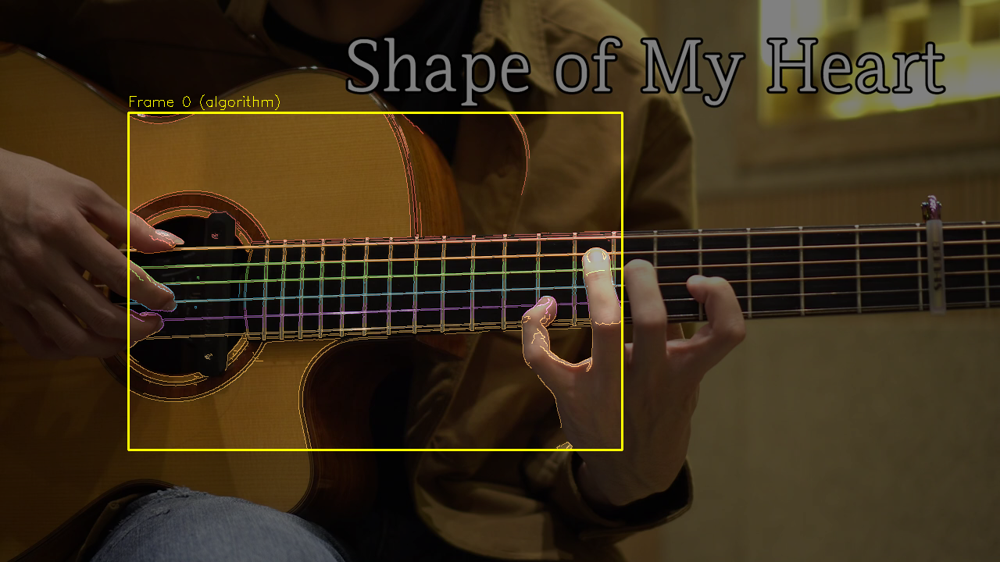

### Skin Detection (Detail)

We convert the frame to HSV and threshold for skin tones: Hue 0-20 (red/orange range), Saturation >= 48, Value >= 80. A small morphological open (erode then dilate) removes noise. For each column in the ROI, we compute the fraction of skin pixels in a 9-pixel-wide band. Columns below `skinFracThresh` are considered "between hands" (low skin = fretboard visible). We find the longest contiguous run of such columns and require it to span at least `minRunFrac` of the frame width.

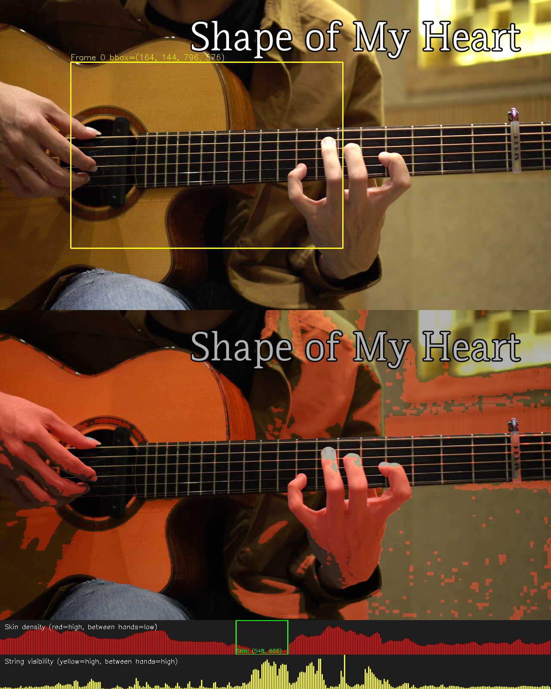

Top to bottom: original frame; skin mask overlay (red = skin); skin density per column (low = between hands); string visibility per column (high = between hands). Yellow box = algorithm-detected used region.

### String Visibility

For each column, we sample the vertical Sobel gradient along all 6 string lines. The minimum across strings gives the weakest string visibility at that x. Columns above `stringMinFrac` of the peak are "good." We take the longest run of good columns, preferring runs near frame center.

### Fine Tuning

Parameters in `config/hands_region.json`:

| Param | Default | Description |
|-------|---------|-------------|
| `roi_height` | "auto" | `"auto"` = use hands_region; `[minFrac, maxFrac]` = fixed vertical bounds |
| `roi_width` | "auto" | `"auto"` = use hands_region; `[minFrac, maxFrac]` = fixed horizontal bounds |
| `roi_height_fixed` | [0.2, 0.8] | Fallback when roi_height is "auto" (search area for skin) |
| `roi_width_fixed` | [0.2, 0.8] | Fallback when roi_width is "auto" |
| `stringHeightPadding` | 0.15 | Padding around string-based height when refining bbox |
| `skinFracThresh` | 0.30 | Skin fraction threshold; columns below = between hands |
| `minRunFrac` | 0.08 | Minimum run length as fraction of frame width |
| `leftStretchFrac` | 0.30 | Extend detected left edge outward by this fraction of width |
| `rightStretchFrac` | 0.10 | Extend detected right edge outward |
| `smoothingAlpha` | 0.70 | Temporal smoothing (higher = less smoothing) |
| `stringMinFrac` | 0.40 | String visibility threshold as fraction of peak |

Filtering to the relevant zone improves suspect detection:

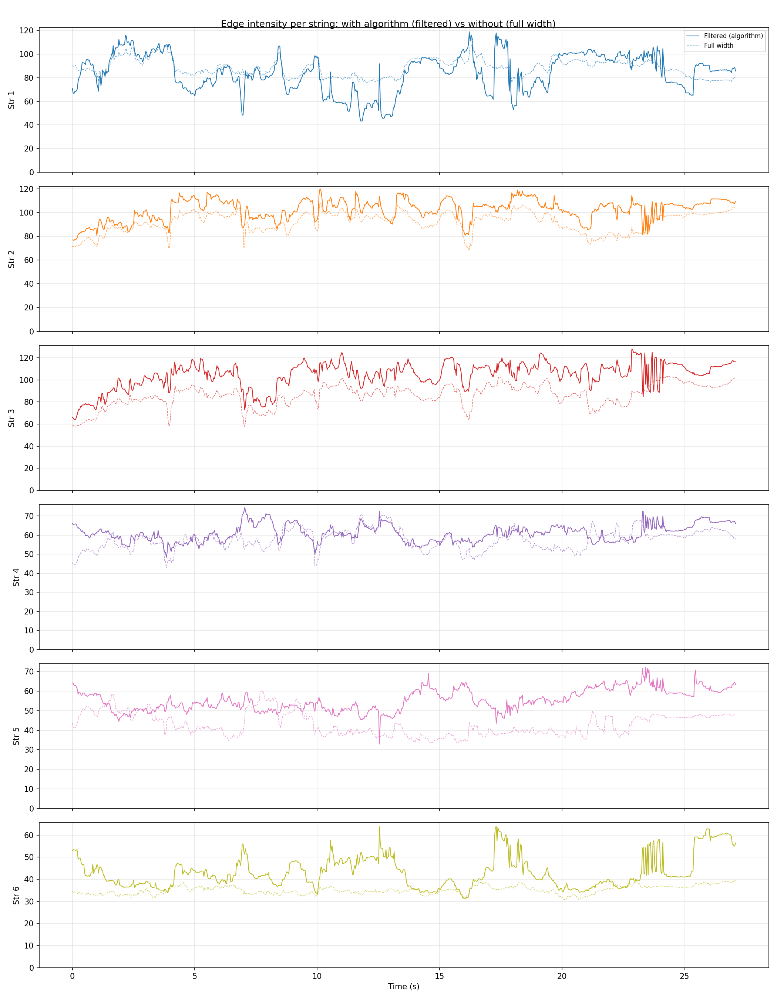

Filtered traces show higher dynamic range and clearer peaks/dips. Full-width traces are smoother and diluted by background.

---

## Annotation Tool

Single-window annotator with:

- **N/P** - Next/previous suspect frame
- **Space** - Play/pause (with audio when available)
- **Arrows** - Frame step
- **V** - Mark suspect as correct (on suspect frames)
- **1-6** - Annotate string played (on suspect: correct wrong detection; on any frame: manual tag for algorithm misses)
- **Q** - Quit
- **-a** - Use algorithm for hands region (no calibration)

### Iterations

| Change | Reason |
|--------|--------|
| Frame-by-frame -> Suspect-only | Too many frames; focus on algorithm detections |
| Two windows -> Single window | Simpler; one view with sound and overlay |
| Rectangles -> Colored edges + legend | Rectangles cluttered; colored edges show string assignment clearly |
| C/N/1-6 -> V/1-6 | V = correct, 1-6 = wrong or manual tag |
| A/D -> N/P | N/P for next/prev suspect |
| Play only with audio -> Play without audio | Space works even when ffmpeg unavailable |
| Suspect-only navigation -> Arrows for any frame | Can manually tag frames algorithm missed |
| Calibration-only -> Algorithm option | `-a` flag uses hands region algorithm |

---

## Audio

**Originally** we used `ffmpeg` from system PATH. **Problem**: PATH not always visible to Python (e.g. IDE terminal, user env vars not propagated). **Changed** to `imageio-ffmpeg` which bundles ffmpeg - no PATH needed. Run `pip install imageio-ffmpeg`.

---

## Output

- `output/annotations.json` - All annotations (correct, wrong, manual)
- `output/debug/` - String tracking debug images
- `output/debug_hands/` - Hands region debug images
- `output/algorithm_100_frames/` - Algorithm-detected region per frame
- `output/calibration_preview/` - Calibration preview
- `output/compare_edge_intensity.png` - Filtered vs full width comparison

Regenerate images:

```
python run_string_tracking.py data/video.mp4 -o out --no-show
python -m scripts.inference.generateDebugImages
python run_hands_region.py debug
python -m scripts.inference.outputAlgorithmResults
python run_compare_intensity
```

---

## Next Steps

- Compare algorithm suspects to human annotations (precision/recall)
- Tune drop threshold and baseline window
- Consider temporal smoothing or multi-frame confirmation
