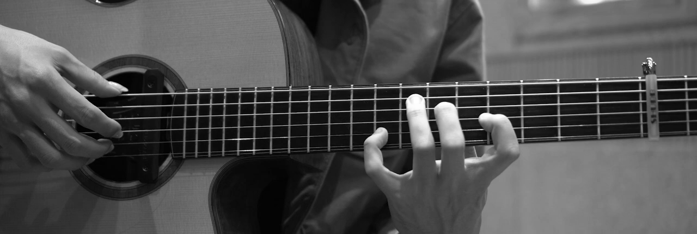
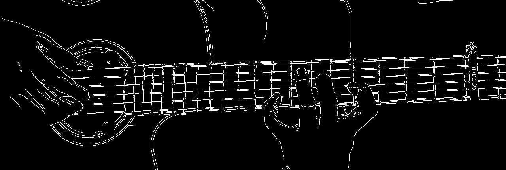
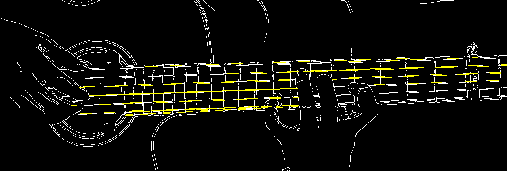
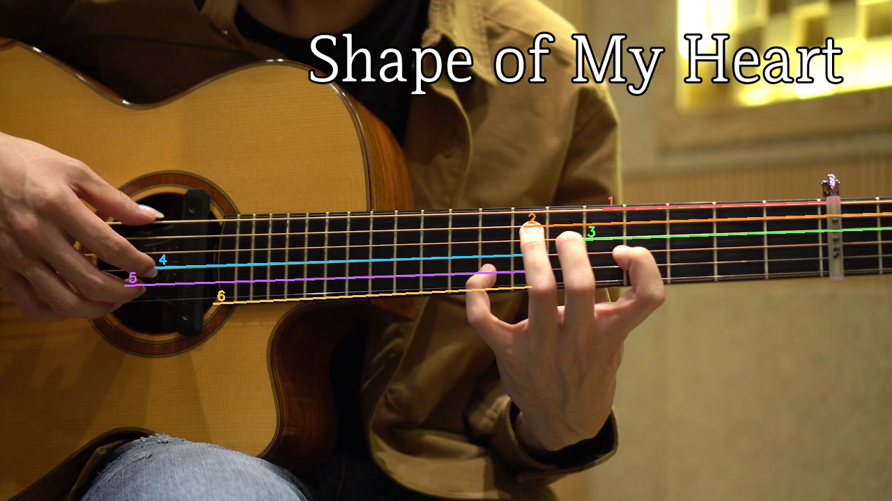
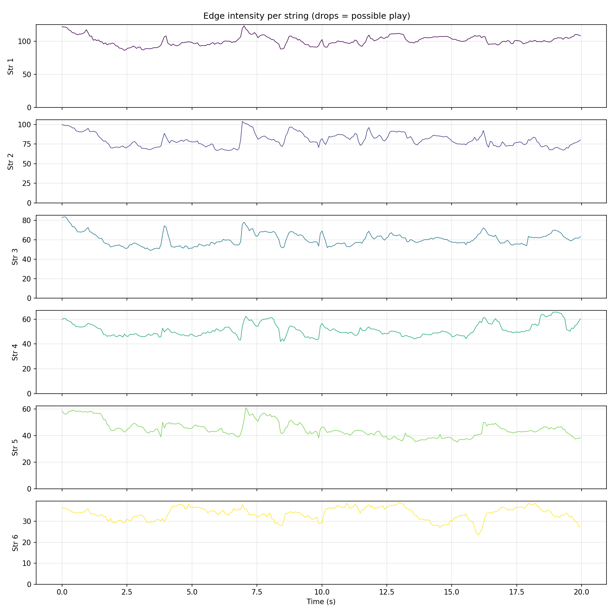

# Guitar Tab Inference - Process Documentation

Work-in-progress documentation of our approach to infer which guitar strings are played from video using edge detection and motion blur.

---

## Hypothesis

When a guitar string is played, it vibrates at high speed. This motion causes **blur** in the video frame: the string "smears" across multiple pixels. A stationary string has sharp edges; a vibrating string has softer, spread-out edges. Therefore: **a drop in edge intensity** around a string indicates it was likely played.

---

## Pipeline Overview

1. **Calibration** - Detect the 6 string positions from the first frame
2. **Suspect Detection** - Scan video for frames where edge intensity drops
3. **Annotation** - Human validates/corrects suspects and tags missed frames
4. **Evaluation** (future) - Compare algorithm output to annotations

---

## Calibration: Finding the Strings

We use the first frame to locate the 6 strings. The process:

### Step 1: Original Frame


### Step 2: Region of Interest

Define the fretboard area (20%-80% of frame height) to avoid hands, headstock, etc. We crop to this region before edge detection.


### Step 3: Crop and Edge Detection

Crop the grayscale to the ROI, then apply Canny edge detection (thresholds 50, 150). Only the fretboard region is processed - this reduces noise from hands, face, and background.





### Step 4: Hough Line Transform

Run `cv2.HoughLinesP` on the cropped edges to find line segments. We keep lines that are roughly horizontal (within 35 degrees) since guitar strings run across the frame.



### Step 5: Select 6 String Lines

- Sort candidate lines by vertical position at frame center
- Pick 6 evenly spaced lines (top = string 1, bottom = string 6)
- If Hough fails, fallback to 6 evenly spaced horizontal bands in the ROI
- Convert line coordinates back to full-frame for overlay



### Iteration: Actual Cropping

**Originally** we applied Canny to the full frame and only used the ROI for Hough. The edge image was full-size. **Changed** to crop the grayscale to the ROI before Canny - edge detection now runs only on the fretboard, reducing noise from hands and background.

### Iteration: Angled Strings

**Originally** we assumed strings were strictly horizontal. **Changed** because the camera angle or fretboard perspective often makes strings appear at a slight angle. We now use `detectStringLinesAngled` which allows lines up to 35 degrees from horizontal and returns full line segments `(x1,y1,x2,y2)` instead of just y-positions.

---

## Edge-to-String Assignment

We need to assign each edge pixel to a string for visualization and intensity tracking.

### Iteration: Distance vs Band Boundaries

**Originally** we used "nearest string line" by perpendicular distance. **Problem**: with angled strings and occlusion (e.g. hand), string 1 could "steal" edges from string 2 - each string took some from the one below. **Changed** to band-based assignment: at each x, compute the y-position of each string line; boundaries are midpoints between adjacent strings; each edge falls into exactly one band. Non-overlapping, respects angle.


### Final Overlay

Frame with colored edges (in ROI) and string legend (bottom right).


---

## Suspect Detection

For each frame we compute **edge intensity** per string: mean vertical Sobel gradient in a band around the string line. A rolling median over the previous 25 frames gives the baseline. If `current < baseline * (1 - 0.18)` (18% drop), we mark that string as suspected.



---

## Annotation Tool

Single-window annotator with:

- **N/P** - Next/previous suspect frame
- **Space** - Play/pause (with audio when available)
- **Arrows** - Frame step
- **V** - Mark suspect as correct (on suspect frames)
- **1-6** - Annotate string played (on suspect: correct wrong detection; on any frame: manual tag for algorithm misses)
- **Q** - Quit

### Iterations

| Change | Reason |
|-------|--------|
| Frame-by-frame -> Suspect-only | Too many frames; focus on algorithm detections |
| Two windows -> Single window | Simpler; one view with sound and overlay |
| Rectangles -> Colored edges + legend | Rectangles cluttered; colored edges show string assignment clearly |
| C/N/1-6 -> V/1-6 | V = correct, 1-6 = wrong or manual tag |
| A/D -> N/P | N/P for next/prev suspect |
| Play only with audio -> Play without audio | Space works even when ffmpeg unavailable |
| Suspect-only navigation -> Arrows for any frame | Can manually tag frames algorithm missed |

---

## Audio

**Originally** we used `ffmpeg` from system PATH. **Problem**: PATH not always visible to Python (e.g. IDE terminal, user env vars not propagated). **Changed** to `imageio-ffmpeg` which bundles ffmpeg - no PATH needed. Run `pip install imageio-ffmpeg`.

---

## Output

- `output/annotations.json` - All annotations (correct, wrong, manual)
- `output/debug/` - Debug images from `scripts/generateDebugImages.py`

Regenerate debug images (also copies to `docs/images/` for this doc):

```
python scripts/generateDebugImages.py
```

---

## Next Steps

- Compare algorithm suspects to human annotations (precision/recall)
- Tune drop threshold and baseline window
- Consider temporal smoothing or multi-frame confirmation
